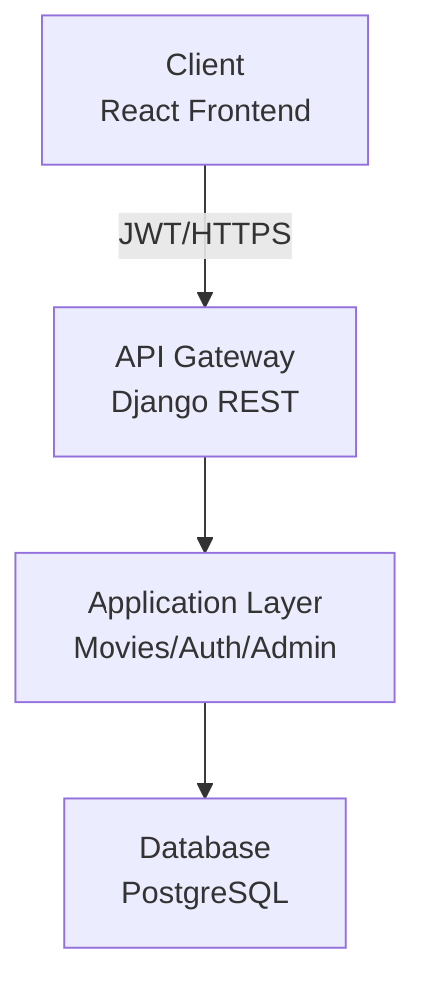
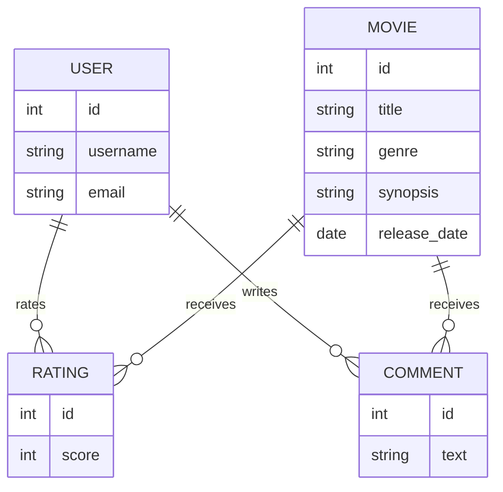
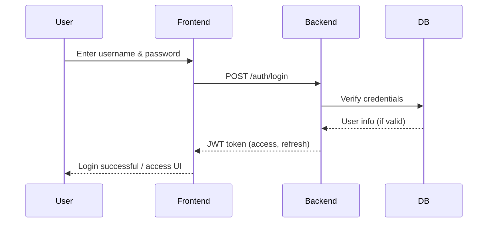
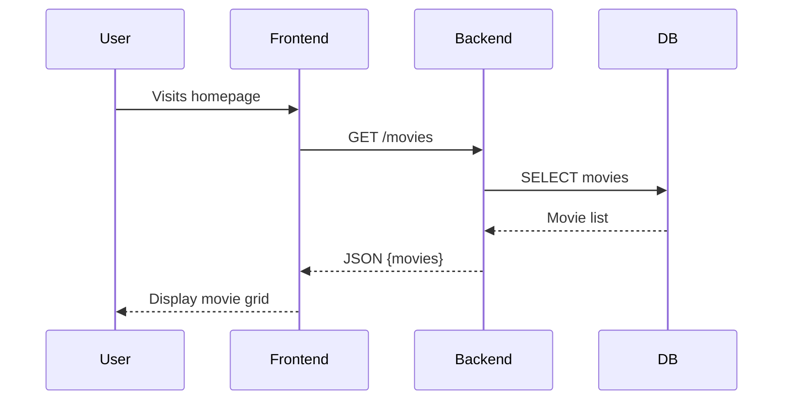
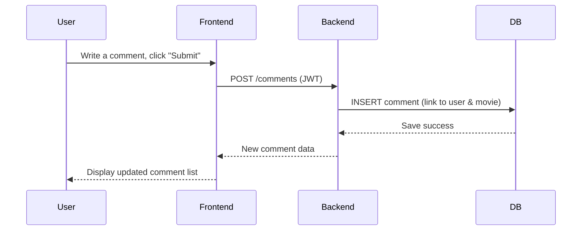

# Table of Contents

1. [User Stories and Mockups](#1-user-stories-and-mockups)

  1.1 [Prioritized User Stories (MoSCoW)](#11-prioritized-user-stories-moscow)

  1.2 [Mockups](#12-mockups)

2. [System Architecture](#2-system-architecture)

  2.1 [High-Level Architecture Diagram](#21-high-level-architecture-diagram)

  2.2 [Data Flow Description](#22-data-flow-description)

  2.3 [Technology Stack Summary](#23-technology-stack-summary)

3. [Components, Classes, and Database Design](#components-classes-and-database-design)

  3.1 [Backend Key Classes](#backend-key-classes)

  3.2 [Database Design](#32-database-design)

  3.3 [Frontend Main Components & Interactions](#33-frontend-main-components--interactions)

  3.4 [High-Level Sequence Diagrams](#34-high-level-sequence-diagrams)

4. [API Documentation](#4-api-documentation)

  4.1 [External APIs](#41-external-apis)

  4.2 [Internal REST API Endpoints](#42-internal-rest-api-endpoints)

5. [SCM and QA Strategy](#5-scm-and-qa-strategy)

  5.1 [Source Control Management](#51-source-control-management)

  5.2 [Quality Assurance](#52-quality-assurance)

  5.3 [Tools Used](#53-tools-used)

---

## 1. User Stories and Mockups

### 1.1 Prioritized User Stories (MoSCoW Method)

#### 1.1.1 Must Have (MVP)

1. **Browse movie catalog**

   - **User Story**  
     As a user, I want to browse a catalog of movies with basic information (title, poster, synopsis, genre, rating), so that I can quickly find something interesting to watch.
   - **Related Feature(s)**: Movie Catalog, Streaming Platform Links  

2. **View detailed movie information**

   - **User Story**  
     As an user, I want to open a movie detail page with extended information (synopsis, genres, cast, average rating, where to watch), so that I can decide whether this movie fits my preferences.
   - **Related Feature(s)**: Movie Catalog, Streaming Availability, Streaming Platform Links  

3. **Create an account**

   - **User Story**  
     As an user, I want to create an account with a secure signup process, so that I can rate and comment on movies.
   - **Related Feature(s)**: User Accounts  

4. **Log in / log out**

   - **User Story**  
     As a (registered) user, I want to log in and log out securely, so that I can use my personal account without exposing my data.
   - **Related Feature(s)**: User Accounts  

5. **Rate a movie**

   - **User Story**  
     As a (logged‑in) user, I want to rate a movie, so that I can share my opinion and influence the average rating.
   - **Related Feature(s)**: Ratings & Comments  

6. **Write and read comments**

   - **User Story**  
     As a (logged‑in user), I want to write comments on a movie and read other users’ comments, so that I can understand what the community thinks about it.
   - **Related Feature(s)**: Ratings & Comments  

7. **See where a movie is available**

   - **User Story**  
     As a user, I want to see on which streaming platforms a movie is currently available, so that I don’t waste time checking each platform manually.
   - **Related Feature(s)**: Streaming Availability, Streaming Platform Links  

---

#### 1.1.2 Should Have

11. **See movie trailers**

    - **User Story**  
      As a user, I want to watch a trailer directly from the movie page, so that I can quickly decide if the movie matches my taste.
    - **Related Feature(s)**: Movie Trailers

12. **Add a movie to favorites**

    - **User Story**  
      As a logged‑in user, I want to add movies to a favorites list, so that I can keep track of what I want to watch later.
    - **Related Feature(s)**: Add to Favorites   

15. **See nearby media libraries**

    - **User Story**  
      As a user, I want to know if a movie is available in nearby media libraries (if geolocation is enabled), so that I can borrow physical copies instead of streaming.
    - **Related Feature(s)**: Geolocation of Media Libraries

16. **Immersive wallpaper / theming**

    - **User Story**  
      As a user, I want the interface to adapt visually to the movie I’m viewing (e.g., background image / wallpaper), so that the experience feels more immersive.
    - **Related Feature(s)**: Wallpaper    

---

#### 1.1.3 Could Have

10. **Participate in a basic community chat / forum**

    - **User Story**  
      As a (logged‑in user), I want to post short messages in a simple movie discussion area, so that I can talk about recommendations with other users.
    - **Related Feature(s)**: Community Forum / Chat  

11. **Like other users’ reviews**

    - **User Story**  
      As a (logged‑in) user, I want to like reviews that I find useful, so that the most helpful comments are highlighted.
    - **Related Feature(s)**: User Likes on Reviews  

12. **Earn badges based on activity**

    - **User Story**  
      As an (active) user, I want to earn badges when I contribute (posting reviews, ratings, etc.), so that I feel rewarded for participating.
    - **Related Feature(s)**: Badge System  

---

#### 1.1.4 Won’t Have (for this MVP)

17. **AI-based personalized recommendations**

    - **User Story**  
      As a user, I would like to receive AI‑based personalized movie recommendations, so that I discover new content that matches my tastes.
    - **Related Feature(s)**: AI Recommendations  
    - **Reason**: Too complex for the current timeline and skill set.

18. **One‑to‑one private chat**

    - **User Story**  
      As a user, I would like to chat privately with another user about movies, so that we can share recommendations directly.
    - **Related Feature(s)**: One-to-One Chat  
    - **Reason**: Too time‑consuming and not essential for the core value of the MVP.

---

### 1.2 Mockups

You can take a look of our mockups on the following directory (on github) : 

MElisoltanov/WhichMovieTonight/DOCUMENTATION/Mockups
https://github.com/MElisoltanov/WhichMovieTonight/tree/main/DOCUMENTATION/Mockups

---

## 2. System Architecture

### 2.1 High-Level Architecture Diagram

### 2.2 Data Flow Description

- **Client (React/Vite):** User interface, sends requests, receives data.
- **API Gateway (Django REST):** Handles authentication, routes API calls.
- **Application Logic:** Business logic for movies, user accounts, admin.
- **Database (PostgreSQL):** Stores all persistent data (movies, users, ratings, comments).

### 2.3 Technology Stack Summary

| Layer | Technology | Purpose |
|-------|-----------|---------|
| **Frontend** | React 18.2 | UI components and state management |
| | React Router DOM 6.20 | Client-side routing |
| | Axios 1.6 | HTTP client for API calls |
| | TailwindCSS 3.3 | Utility-first CSS styling |
| | Vite 5.0 | Fast build tool and dev server |
| **Backend** | Django 5.0 | Web framework |
| | Django REST Framework 3.14 | REST API toolkit |
| | SimpleJWT 5.3 | JWT authentication |
| | CORS Headers 4.3 | Cross-origin resource sharing |
| **Database** | PostgreSQL | Relational database |
| | psycopg2-binary 2.9 | PostgreSQL adapter |
| **Hosting** | To be determined | (Heroku, AWS, DigitalOcean, or Hugo) |

---

## 3. Components, Classes, and Database Design

### 3.1 Backend Key Classes

**Movie**
- title, synopsis, genre, release_date, cast, poster_url, backdrop_url, trailer_url

**Rating**
- movie (FK), user (FK), score (1–5)

**Comment**
- movie (FK), user (FK), text

---

### 3.2 Database Design (Relational – PostgreSQL)

**Main Relationships:**
- A user rates & comments movies.
- A movie has many ratings and comments.

---

### 3.3 Frontend Main Components & Interactions

- **Navbar:** Navigation / Auth links
- **MovieCard:** Shows movie basic info in a grid
- **MovieDetail:** Shows all details, ratings, comments, streaming links
- **SearchBar:** Search movies (title, genre, cast)
- **StarRating:** Rate 1–5 stars
- **CommentSection:** Write/read/edit/delete comments (if logged in)
- **Dashboard:** (Admin) Manage movies

**Interactions:**
- Users browse/search movies with *MovieCard* and *SearchBar*
- Click reveals *MovieDetail*, where they rate (*StarRating*) and comment (*CommentSection*)
- Admin manages movies via *Dashboard*

---

### 3.4 High-Level Sequence Diagrams (Essential Version)

#### 3.4.1 User Login

---

#### 3.4.2 Browse Movie Catalog

---

#### 3.4.3 Add a Movie Comment

---

## 4. API Documentation

### 4.1 External APIs

- **No external APIs are used in the MVP.**
  - All movie data, ratings, comments, and streaming links are stored and managed internally.

---

### 4.2 Internal REST API Endpoints

| Resource      | URL Path                 | Method | Auth | Description                      | Input format    | Output format         |
|---------------|--------------------------|--------|------|-----------------------------------|-----------------|----------------------|
| Movies        | `/api/movies/`           | GET    | No   | Fetch all movies (optionally search)   | ?search=      | List of movies (JSON)|
| Movie detail  | `/api/movies/{id}/`      | GET    | No   | Get specific movie                | -               | Movie (JSON)         |
| Movies        | `/api/movies/`           | POST   | Yes (admin) | Add new movie                | JSON body        | Movie (JSON)         |
| Movies        | `/api/movies/{id}/`      | PUT/PATCH | Yes (admin) | Edit movie                 | JSON body        | Movie (JSON)         |
| Movies        | `/api/movies/{id}/`      | DELETE | Yes (admin) | Delete movie                 | -               | -                    |
| Ratings       | `/api/ratings/`          | GET    | No   | Get ratings (filter by movie)     | ?movie_id=      | List of ratings      |
| Ratings       | `/api/ratings/`          | POST   | Yes  | Create or update user’s rating    | JSON body        | Rating (JSON)        |
| Ratings       | `/api/ratings/{id}/`     | DELETE | Yes  | Delete user rating                | -               | -                    |
| Comments      | `/api/comments/`         | GET    | No   | Get comments (filter by movie)    | ?movie_id=      | List of comments     |
| Comments      | `/api/comments/`         | POST   | Yes  | Create new comment                | JSON body        | Comment (JSON)       |
| Comments      | `/api/comments/{id}/`    | PUT    | Yes  | Edit comment                      | JSON body        | Comment (JSON)       |
| Comments      | `/api/comments/{id}/`    | DELETE | Yes  | Delete comment                    | -               | -                    |
| Auth Register | `/api/auth/register/`    | POST   | No   | Create new user account           | JSON body        | User + JWT tokens    |
| Auth Login    | `/api/auth/login/`       | POST   | No   | User login (get tokens)           | JSON body        | User + JWT tokens    |
| Auth User     | `/api/auth/user/`        | GET    | Yes  | Get current user info             | -                | User info (JSON)     |
| Auth Logout   | `/api/auth/logout/`      | POST   | Yes  | Logout (JWT blacklist)            | JSON body        | Confirmation         |

**Notes:**
- All JSON body inputs follow standard REST conventions (`application/json`).
- Most GET endpoints support filtering via query parameters (e.g. `/ratings/?movie_id=123`).
- Output: JSON objects, lists or status response, error details when relevant.
- Authentication via JWT, sent in `Authorization: Bearer <token>`.
- Admin endpoints restricted by user permissions.

---

## 5. SCM and QA Strategy (Essential Version)

### 5.1 Source Control Management (SCM)

- **Tool:** Git + GitHub
- **Branching:**  
  - `main` → stable production code  
  - `dev` → integration/development  
  - `feature/*` → new features  
  - Branches merged via Pull Request (PR); each PR is reviewed by the other team member.
- **Commits:**  
  - Clear, atomic commits (one logical change per commit).  
  - Conventional commit format (feat:, fix:, docs:, etc.).
- **Code Reviews:**  
  - At least one code review before PR merge.  
  - Peer testing encouraged.

---

### 5.2 Quality Assurance (QA)

- **Unit Tests:**  
  - **Backend:** Django TestCase  
  - **Frontend:** Jest + React Testing Library (planned)
- **Integration Tests:**  
  - API endpoints tested via Postman/Insomnia.
- **Manual Testing:**  
  - Critical flows (signup, login, movie browsing, rating, comment) tested on desktop and mobile.
- **Deployment:**  
  - Manual for MVP (future: CI/CD pipeline via GitHub Actions).
  - Staging environment before production.
- **Issue Tracking:**  
  - GitHub Issues: bugs, enhancements, questions.

---

### 5.3 Tools Used

- **Versioning:** Git, GitHub
- **Backend Testing:** Django TestCase
- **Frontend Testing:** Jest (planned)
- **API Testing:** Postman
- **CI/CD:** GitHub Actions (future)
