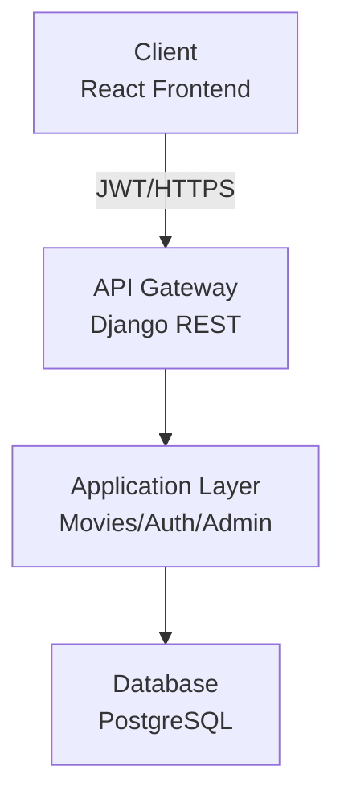

## 1. User Stories and Mockups

### 1.1 Prioritized User Stories (MoSCoW Method)

#### Must Have (MVP)

1. **Browse movie catalog**

   - **User Story**  
     As a user, I want to browse a catalog of movies with basic information (title, poster, synopsis, genre, rating), so that I can quickly find something interesting to watch.
   - **Related Feature(s)**: Movie Catalog, Streaming Platform Links  

2. **View detailed movie information**

   - **User Story**  
     As an user, I want to open a movie detail page with extended information (synopsis, genres, cast, average rating, where to watch), so that I can decide whether this movie fits my preferences.
   - **Related Feature(s)**: Movie Catalog, Streaming Availability, Streaming Platform Links  

3. **Create an account**

   - **User Story**  
     As an user, I want to create an account with a secure signup process, so that I can rate and comment on movies.
   - **Related Feature(s)**: User Accounts  

4. **Log in / log out**

   - **User Story**  
     As a (registered) user, I want to log in and log out securely, so that I can use my personal account without exposing my data.
   - **Related Feature(s)**: User Accounts  

5. **Rate a movie**

   - **User Story**  
     As a (logged‑in) user, I want to rate a movie, so that I can share my opinion and influence the average rating.
   - **Related Feature(s)**: Ratings & Comments  

6. **Write and read comments**

   - **User Story**  
     As a (logged‑in user), I want to write comments on a movie and read other users’ comments, so that I can understand what the community thinks about it.
   - **Related Feature(s)**: Ratings & Comments  

7. **See where a movie is available**

   - **User Story**  
     As a user, I want to see on which streaming platforms a movie is currently available, so that I don’t waste time checking each platform manually.
   - **Related Feature(s)**: Streaming Availability, Streaming Platform Links  

---

#### Should Have

11. **See movie trailers**

    - **User Story**  
      As a user, I want to watch a trailer directly from the movie page, so that I can quickly decide if the movie matches my taste.
    - **Related Feature(s)**: Movie Trailers

12. **Add a movie to favorites**

    - **User Story**  
      As a logged‑in user, I want to add movies to a favorites list, so that I can keep track of what I want to watch later.
    - **Related Feature(s)**: Add to Favorites   

15. **See nearby media libraries**

    - **User Story**  
      As a user, I want to know if a movie is available in nearby media libraries (if geolocation is enabled), so that I can borrow physical copies instead of streaming.
    - **Related Feature(s)**: Geolocation of Media Libraries

16. **Immersive wallpaper / theming**

    - **User Story**  
      As a user, I want the interface to adapt visually to the movie I’m viewing (e.g., background image / wallpaper), so that the experience feels more immersive.
    - **Related Feature(s)**: Wallpaper    

---

#### Could Have

10. **Participate in a basic community chat / forum**

    - **User Story**  
      As a (logged‑in user), I want to post short messages in a simple movie discussion area, so that I can talk about recommendations with other users.
    - **Related Feature(s)**: Community Forum / Chat  

11. **Like other users’ reviews**

    - **User Story**  
      As a (logged‑in) user, I want to like reviews that I find useful, so that the most helpful comments are highlighted.
    - **Related Feature(s)**: User Likes on Reviews  

12. **Earn badges based on activity**

    - **User Story**  
      As an (active) user, I want to earn badges when I contribute (posting reviews, ratings, etc.), so that I feel rewarded for participating.
    - **Related Feature(s)**: Badge System  

---

#### Won’t Have (for this MVP)

17. **AI-based personalized recommendations**

    - **User Story**  
      As a user, I would like to receive AI‑based personalized movie recommendations, so that I discover new content that matches my tastes.
    - **Related Feature(s)**: AI Recommendations  
    - **Reason**: Too complex for the current timeline and skill set.

18. **One‑to‑one private chat**

    - **User Story**  
      As a user, I would like to chat privately with another user about movies, so that we can share recommendations directly.
    - **Related Feature(s)**: One-to-One Chat  
    - **Reason**: Too time‑consuming and not essential for the core value of the MVP.

---

### 1.2 Mockups

You can take a look of our mockups on the following directory (on github) : 

MElisoltanov/WhichMovieTonight/DOCUMENTATION/Mockups

---

## 2. System Architecture

### 2.1 High-Level Architecture Diagram

### 2.2 Data Flow Description

- **Client (React/Vite):** User interface, sends requests, receives data.
- **API Gateway (Django REST):** Handles authentication, routes API calls.
- **Application Logic:** Business logic for movies, user accounts, admin.
- **Database (PostgreSQL):** Stores all persistent data (movies, users, ratings, comments).

### 2.3 Technology Stack Summary

| Layer | Technology | Purpose |
|-------|-----------|---------|
| **Frontend** | React 18.2 | UI components and state management |
| | React Router DOM 6.20 | Client-side routing |
| | Axios 1.6 | HTTP client for API calls |
| | TailwindCSS 3.3 | Utility-first CSS styling |
| | Vite 5.0 | Fast build tool and dev server |
| **Backend** | Django 5.0 | Web framework |
| | Django REST Framework 3.14 | REST API toolkit |
| | SimpleJWT 5.3 | JWT authentication |
| | CORS Headers 4.3 | Cross-origin resource sharing |
| **Database** | PostgreSQL | Relational database |
| | psycopg2-binary 2.9 | PostgreSQL adapter |
| **Hosting** | To be determined | (Heroku, AWS, DigitalOcean, or Hugo) |

---