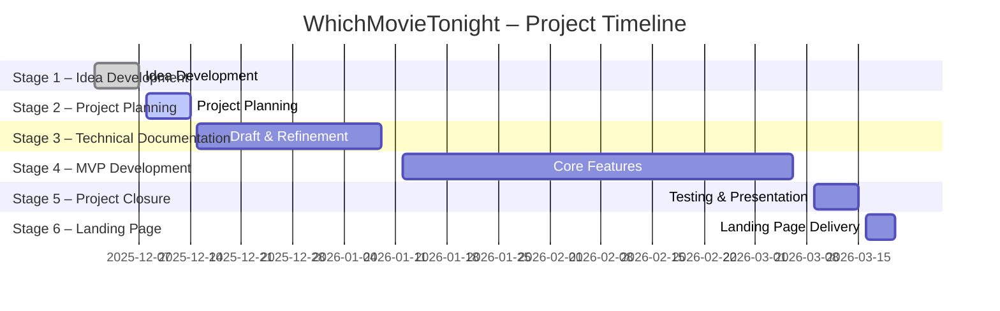

# Stage 1 Report — Team Formation, Brainstorming & MVP Definition

Portfolio Project — France Program

---

## Table of Contents

1. [Team Formation & Roles](#1-team-formation--roles)  
2. [Brainstorming & Idea Evaluation](#2-brainstorming--idea-evaluation)  
   - [Idea 1 — WhichMovieTonight (Selected)](#idea-1--whichmovietonight-selected)  
   - [Idea 2 — Medical Collaboration Platform (Tutoré)](#idea-2--medical-collaboration-platform-tutoré)  
   - [Idea 3 — Gym Facility Management Software (Tutoré)](#idea-3--gym-facility-management-software-tutoré)  
3. [Final Decision & MVP Refinement](#3-final-decision--mvp-refinement)  
   - [Problem Statement](#problem-statement)  
   - [Proposed Solution](#proposed-solution)  
   - [Target Users](#target-users)  
   - [Application Type](#application-type)  
4. [MVP Key Features (SMART-Aligned)](#4-mvp-key-features-smart-aligned)  
5. [Project Scope](#5-project-scope)  
6. [Risks & Mitigation](#6-risks--mitigation)  
7. [Expected Outcome](#7-expected-outcome)  

---

## 1. Team Formation & Roles

### Team Members

**Flora Salanson — Backend Developer**  
- Experience in backend development, API integration, and database management.  
- Previously collaborated on Binary Trees, Hbnb, and Simple Shell projects.

**Moussa Elisoltanov — Frontend Developer**  
- Focuses on UI/UX design, responsive layouts, and frontend-backend integration.

### Team Strengths

- Previous collaborations ensure smooth communication and efficient task distribution.  
- Roles assigned based on personal preferences and technical strengths.

### Collaboration Strategy

- In-person meetings whenever possible.  
- WhatsApp and Slack for daily communication.  
- Shared documents via Google Docs / Notion.  
- Decisions made through discussion and consensus.

### Stakeholders

- No external stakeholders at this stage.

---

## 2. Brainstorming & Idea Evaluation

### Idea 1 — WhichMovieTonight (Selected)

A mobile-first web platform helping users find a movie quickly, with:

- Community-driven ratings and reviews  
- Availability information across streaming platforms and libraries  
- Optional chat for community discussions  

**Risk:** Use of the unofficial JustWatch API, which may change routes or be unstable.

### Idea 2 — Medical Collaboration Platform (Tutoré)

A platform connecting medical doctors with scientific writers/researchers for co-authoring medical articles.

**Reason for Rejection:**

- Specialized and regulated domain  
- Requires strict data privacy and medical expertise  
- Complex messaging/matching system  
- Less aligned with the team’s interests  

### Idea 3 — Gym Facility Management Software (Tutoré)

Software to manage gym rooms, including scheduling, user access, and equipment tracking.

**Reason for Rejection:**

- Requires multi-role admin system  
- Too complex for a short MVP  
- Less interesting for the team compared to cinema-focused project  

---

## 3. Final Decision & MVP Refinement

### Problem Statement

Users spend excessive time searching for movies on multiple platforms.

### Proposed Solution

A web application that:

- Centralizes movie information  
- Aggregates community reviews  
- Shows where movies can be watched  
- Includes an optional chat for recommendations  

### Target Users

- Movie enthusiasts  
- Streaming platform users  
- Anyone who wants to quickly find a movie  

### Application Type

- Responsive Web Application  
- Mobile-first design  
- Accessible on desktop, tablet, and mobile  

---

## 4. MVP Key Features (SMART-Aligned)

1. **Movie Catalog**: 200+ films with title, synopsis, genre, and average rating  
2. **User Accounts**: Secure registration and login  
3. **Ratings & Comments**: Authenticated users can rate and comment  
4. **Availability Information**: API integration to show streaming/library availability  
5. **Optional Chat**: Basic global chat implemented only if core features are stable  

---

## 5. Project Scope

### In-Scope

- Movie catalog  
- User authentication  
- Ratings & comment system  
- Streaming/library availability  
- Optional chat functionality  

### Out-of-Scope

- AI-powered recommendations  
- Advanced social features (friends, private messages, profiles)  
- Shared playlists or watchlists  

---

## 6. Risks & Mitigation

| Risk                               | Impact             | Mitigation                                      |
| ---------------------------------- | ------------------ | ----------------------------------------------- |
| Unofficial API instability         | Broken data routes | Use abstraction layer + fallback local DB       |
| Optional chat increases complexity | Project delays     | Implement only after core MVP is complete       |
| Limited experience with tools      | Slower development | Schedule learning time + pair programming       |
| Scope creep                        | MVP incomplete     | Strict prioritization of essential features     |

---

## 7. Expected Outcome

By the end of Stage 1, the team has:

- A justified and well-documented MVP  
- Defined team roles and collaboration methods  
- Completed brainstorming with alternative ideas  
- Identified risks and mitigation strategies  

**Stage 2: Planning and Technical Architecture**.

